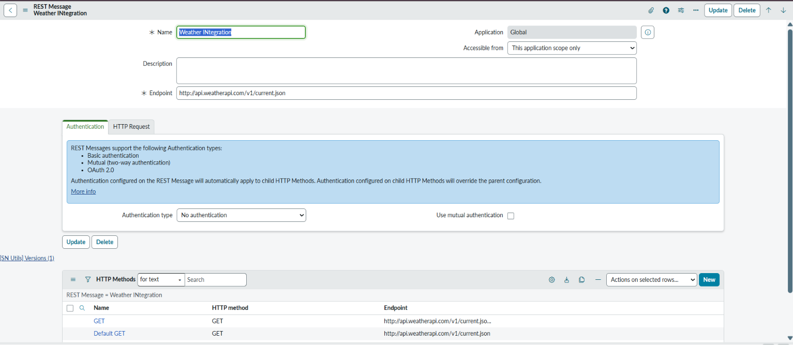

<div align="center">

<h1>🌦️ Weather Application in ServiceNow</h1>

<p>
A custom <b>ServiceNow Weather Application</b> that integrates with the
<b>OpenWeather API</b> to retrieve real-time weather information using REST API integration.
</p>


</div>

---

# 📌 Project Overview

This project demonstrates how to integrate **ServiceNow** with the **OpenWeather API** using **REST Messages**.

The application allows users to retrieve real-time weather information directly from ServiceNow by simply clicking a UI Action.

The project demonstrates:

- REST API Integration
- REST Messages
- Script Includes
- UI Actions
- JSON Parsing
- Server-side Scripting
- External API Consumption

---
# 🎥 Project Demo

The following demo showcases the complete workflow of the Weather Application in ServiceNow.

https://github.com/Vikash8294/Weather_Application-in-Servicenow/issues/1

# 🌐 API Used

<b>OpenWeather API</b>

Website:

https://openweathermap.org/api

The API provides:

- 🌤 Current Weather
- 🌡 Temperature
- 💧 Humidity
- 🌬 Wind Speed
- 🌍 Country
- ☁ Weather Description

---

# 🚀 Features

✅ Fetch Live Weather Data

✅ REST API Integration

✅ REST Message Configuration

✅ JSON Parsing

✅ Script Include

✅ UI Action

✅ Custom Table

✅ Update Set Included

---

# 🛠 Technologies Used

<table>

<tr>
<th>Technology</th>
<th>Purpose</th>
</tr>

<tr>
<td>ServiceNow</td>
<td>Application Development</td>
</tr>

<tr>
<td>JavaScript</td>
<td>Server-side Scripting</td>
</tr>

<tr>
<td>REST API</td>
<td>Weather Integration</td>
</tr>

<tr>
<td>REST Message</td>
<td>API Communication</td>
</tr>

<tr>
<td>JSON</td>
<td>Response Parsing</td>
</tr>

<tr>
<td>OpenWeather API</td>
<td>Weather Provider</td>
</tr>

</table>

---

# 🏗 Application Workflow

```text
User
   │
   ▼
UI Action
   │
   ▼
Script Include
   │
   ▼
REST Message
   │
   ▼
OpenWeather API
   │
   ▼
JSON Response
   │
   ▼
ServiceNow
```

---

# 📂 Project Structure

```text
Weather_Application-in-Servicenow
│
├── Image
│   ├── Get Method.png
│   ├── RestMessage.png
│   ├── Script Include.png
│   ├── ScriptInclude Script.png
│   ├── Table.png
│   ├── UI action Script.png
│   └── ui action.png
│
├── Weather_App.xml
└── README.md
```

---

# 📸 Screenshots

## Custom Table


---

## REST Message



---

## Script Include


---

## Script Include Code


---

## UI Action


---

## UI Action Script


---

## GET Method


---

# 🎥 Project Demo

<p align="center">

<a href="https://youtu.be/YOUR_VIDEO_LINK">


</a>

</p>

Replace the above link with your own YouTube video.

---

# 📥 Installation

### Clone Repository

```bash
git clone https://github.com/Vikash8294/Weather_Application-in-Servicenow.git
```

### Import Update Set

Import

```
Weather_App.xml
```

into your ServiceNow instance.

### Configure REST Message

Configure your OpenWeather API Key inside the REST Message.

### Test

Click the **Get Weather** UI Action.

---

# 📚 Learning Outcomes

- REST API Integration
- ServiceNow REST Messages
- OpenWeather API
- JSON Parsing
- Script Includes
- UI Actions
- GlideRecord
- External API Consumption

---

# 👨‍💻 Author

## Vikash Kumar Singh

MCA (Artificial Intelligence & Machine Learning)

ServiceNow Developer | Java | SQL | AI/ML

### GitHub

https://github.com/Vikash8294

### LinkedIn

https://www.linkedin.com/in/YOUR-LINKEDIN

---

<div align="center">

<h3>⭐ If you like this project, don't forget to Star the repository ⭐</h3>

</div>
